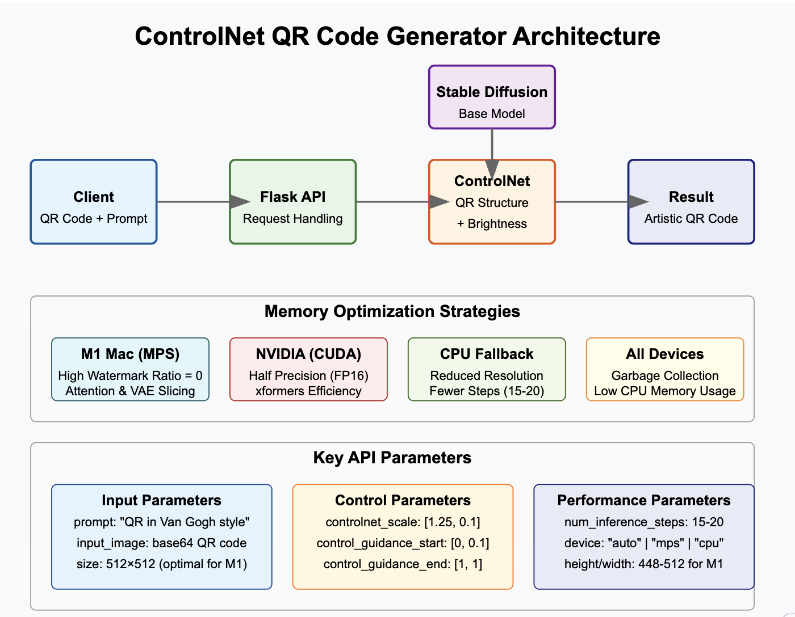

# Comprehensive Guide to ControlNet QR Code Generator

## 1. System Overview

The ControlNet QR Code Generator is a Flask-based API that transforms ordinary QR codes into artistic images while maintaining their scannable functionality. It leverages:

- **Stable Diffusion**: Base text-to-image diffusion model
- **ControlNet**: Specialized model that controls image generation while preserving structure
- **Flask API**: Provides HTTP endpoints for interaction

### High-Level Architecture



## 2. Technical Components

### 2.1 Flask Application Structure

The Flask application follows a modular structure:

```
app/
├── __init__.py           # App factory pattern
├── config.py             # Configuration settings
├── models/               # Model initialization
│   ├── __init__.py
│   └── controlnet.py     # ControlNet model loading
├── routes/               # API endpoints
│   ├── __init__.py
│   ├── generate.py       # Main generation endpoint
│   └── health.py         # Health check endpoints
├── schemas/              # Request validation
│   ├── __init__.py
│   └── generate.py       # Input schema validation
└── utils/                # Helper utilities
    ├── __init__.py
    ├── logging.py        # Logging functionality
    └── validation.py     # Request validation decorator
```

### 2.2 Machine Learning Models

The application uses three key models:

1. **Base Model**: `Lykon/DreamShaper` - A fine-tuned Stable Diffusion model that excels in artistic creations
2. **QR ControlNet**: `monster-labs/control_v1p_sd15_qrcode_monster` - Specialized in QR code transformations
3. **Brightness ControlNet**: `latentcat/control_v1p_sd15_brightness` - Helps maintain proper contrast in images

These models work together in the StableDiffusionControlNetPipeline to generate artistic QR codes that remain functional.

## 3. Data Flow

### 3.1 Request Processing Flow

```
1. Client sends HTTP request with base64 QR code and prompt
   ↓
2. Flask validates request through Marshmallow schema
   ↓
3. Request is processed by generate_image endpoint
   ↓
4. QR code is decoded from base64 to PIL Image
   ↓
5. ML Pipeline processes image with ControlNet
   ↓
6. Generated image is saved to disk
   ↓
7. Generated image is encoded to base64
   ↓
8. Response is sent to client with base64 image and metadata
```

### 3.2 Model Initialization Flow

```
1. Application starts
   ↓
2. Models are NOT loaded immediately (lazy loading)
   ↓
3. On first request, before_request hook triggers
   ↓
4. Device is determined (MPS for M1 Mac, CUDA for NVIDIA, CPU otherwise)
   ↓
5. Memory optimizations are applied based on device
   ↓
6. ControlNet models are loaded with optimized settings
   ↓
7. Stable Diffusion pipeline is created with ControlNets
   ↓
8. Models are moved to the appropriate device
   ↓
9. Additional memory efficiency techniques are applied
```

## 4. API Reference

### 4.1 Generate Endpoint

**URL**: `/generate`
**Method**: `POST`
**Content-Type**: `application/json`

**Request Body**:

```json
{
  "prompt": "QR code in the style of Van Gogh's Starry Night",
  "input_image": "BASE64_ENCODED_QR_CODE",
  "negative_prompt": "ugly, disfigured, low quality, blurry, nsfw",
  "num_inference_steps": 20,
  "controlnet_conditioning_scale": [1.25, 0.1],
  "control_guidance_start": [0, 0.1],
  "control_guidance_end": [1, 1],
  "height": 512,
  "width": 512,
  "device": "auto"
}
```

**Response**:

```json
{
  "message": "Image generated successfully",
  "output_path": "./results/output_a1b2c3d4.png",
  "image": "BASE64_ENCODED_GENERATED_IMAGE",
  "processing_time_seconds": 12.34,
  "device_used": "mps"
}
```

### 4.2 Health Endpoints

**URL**: `/ping`
**Method**: `GET`
**Response**: Simple "OK" response for basic health checks

**URL**: `/health`
**Method**: `GET`
**Response**: Detailed health information including device, model status, etc.

## 5. Memory Management Strategies

The application implements several memory optimization techniques to run efficiently on different devices:

### For M1 Macs (MPS)

1. **High Watermark Ratio**: Set to 0 to disable memory limits (`PYTORCH_MPS_HIGH_WATERMARK_RATIO=0.0`)
2. **Attention Slicing**: Divides attention computation to reduce peak memory
3. **VAE Slicing**: Processes VAE decoding in slices to reduce memory footprint
4. **Garbage Collection**: Forced before and after significant operations

### For NVIDIA GPUs (CUDA)

1. **Half Precision**: Uses FP16 for lower memory footprint
2. **Xformers**: Implements efficient attention mechanisms
3. **All M1 optimizations** also apply to CUDA devices

### For CPU Fallback

1. **Reduced Resolution**: Automatically scales down to 512x512 or lower
2. **Fewer Steps**: Reduces inference steps to 15-20
3. **Sequential Processing**: Optimizes for CPU's linear processing

## 6. Request Parameters Explained

| Parameter                       | Description                                | Default               | Range                        |
| ------------------------------- | ------------------------------------------ | --------------------- | ---------------------------- |
| `prompt`                        | Text description of desired artistic style | _Required_            | Any text                     |
| `input_image`                   | Base64 encoded QR code image               | _Required_            | Valid QR code                |
| `negative_prompt`               | Elements to avoid in generation            | "ugly, disfigured..." | Any text                     |
| `num_inference_steps`           | Number of denoising steps                  | 20                    | 10-50                        |
| `controlnet_conditioning_scale` | Strength of each ControlNet                | [1.25, 0.1]           | 0.0-2.0                      |
| `control_guidance_start`        | When ControlNet starts influencing         | [0, 0.1]              | 0.0-1.0                      |
| `control_guidance_end`          | When ControlNet stops influencing          | [1, 1]                | 0.0-1.0                      |
| `height`                        | Output image height                        | 512                   | 256-1024                     |
| `width`                         | Output image width                         | 512                   | 256-1024                     |
| `device`                        | Processing device                          | "auto"                | "auto", "cpu", "mps", "cuda" |

## 7. ControlNet Technology Explained

ControlNet allows precise control over image generation, preserving structural elements (the QR code) while applying artistic styles.

### How QR Code ControlNet Works

1. **Input**: The original QR code serves as a conditioning image
2. **Structure Preservation**: The first ControlNet ensures the generated image maintains the QR code's scannable structure
3. **Artistic Freedom**: The model balances between structure preservation and artistic interpretation
4. **Brightness Control**: The second ControlNet ensures proper contrast for readability

### Balancing Parameters

- Higher `controlnet_conditioning_scale[0]` (first value) = More accurate QR code structure
- Lower `controlnet_conditioning_scale[0]` = More artistic freedom but risk of breaking QR functionality
- `control_guidance_start/end` control when in the generation process the QR structure is enforced

## 8. Performance Considerations

### M1 Mac Performance

The application is optimized for M1 Macs but has some limitations:

- **Memory Constraints**: M1 unified memory is shared with the system
- **First Run Slowness**: Initial model loading can take 30+ seconds
- **Recommended Settings**: 512x512 resolution with 15-20 steps for balance

### Optimization Tips

For fastest generation on M1 Macs:

- Use 448x448 or 512x512 resolution (must be divisible by 8)
- Use 15-20 inference steps
- If OOM errors occur, force CPU with `device="cpu"`

## 9. Error Handling

The application implements several error handling strategies:

1. **Request Validation**: Marshmallow schema validates all inputs
2. **Memory Management**: Graceful degradation if OOM errors occur
3. **Device Fallback**: Auto-fallback to CPU if GPU processing fails
4. **Detailed Logging**: Comprehensive logging for troubleshooting

## 10. Code Walkthrough: Core Generation Logic

The heart of the application is the image generation function:

```python
# Key section from generate.py
result = pipe(
    prompt=prompt,
    negative_prompt=negative_prompt,
    image=[image, image],  # Same image for both controlnets
    num_inference_steps=num_inference_steps,
    controlnet_conditioning_scale=controlnet_conditioning_scale,
    control_guidance_start=control_guidance_start,
    control_guidance_end=control_guidance_end,
    height=height,
    width=width,
)
```

This single call orchestrates:

1. The diffusion process guided by the text prompt
2. The QR code structure preservation via first ControlNet
3. The brightness/contrast control via second ControlNet
4. The balance between accuracy and artistic style

## 11. Testing and Debugging

### Using the test_api.py Script

The included `test_api.py` script provides an easy way to test the API:

```bash
python test_api.py --image qrs/qr.png --prompt "QR code in Van Gogh style" --size 512 --steps 15
```

### Common Issues and Solutions

1. **OOM Errors**: Reduce image size, reduce steps, or force CPU
2. **Slow Generation**: First run is always slower; subsequent runs are faster
3. **Model Download Issues**: Check internet connection or manually download models
4. **QR Code Unreadable**: Increase first controlnet_conditioning_scale value (>1.25)

## 12. Future Enhancements

The application could be extended with:

1. **Model Quantization**: Further memory optimization
2. **Web UI**: Friendly interface for non-technical users
3. **Additional ControlNets**: More control over artistic style
4. **Batch Processing**: Handle multiple QR codes
5. **AWS Deployment**: Scale via SageMaker as planned
